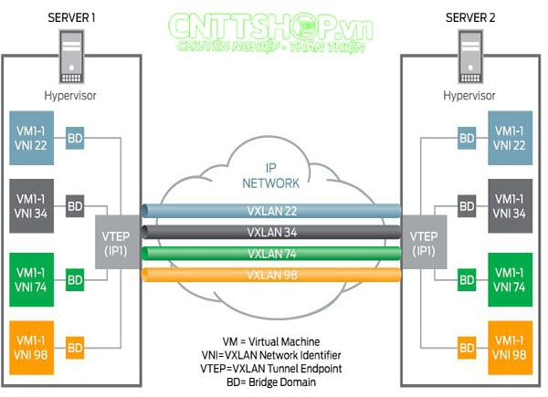
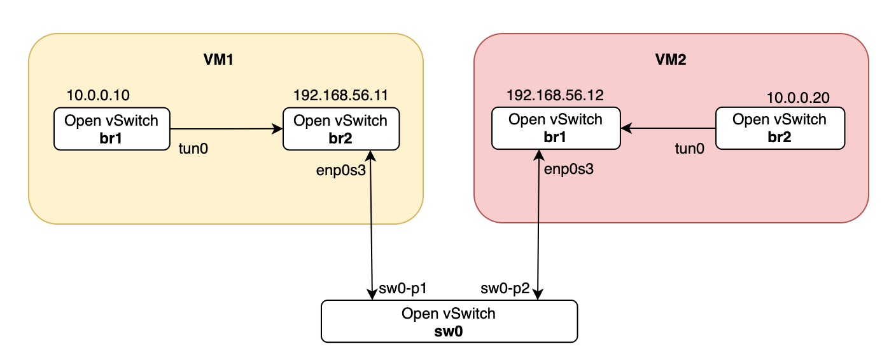
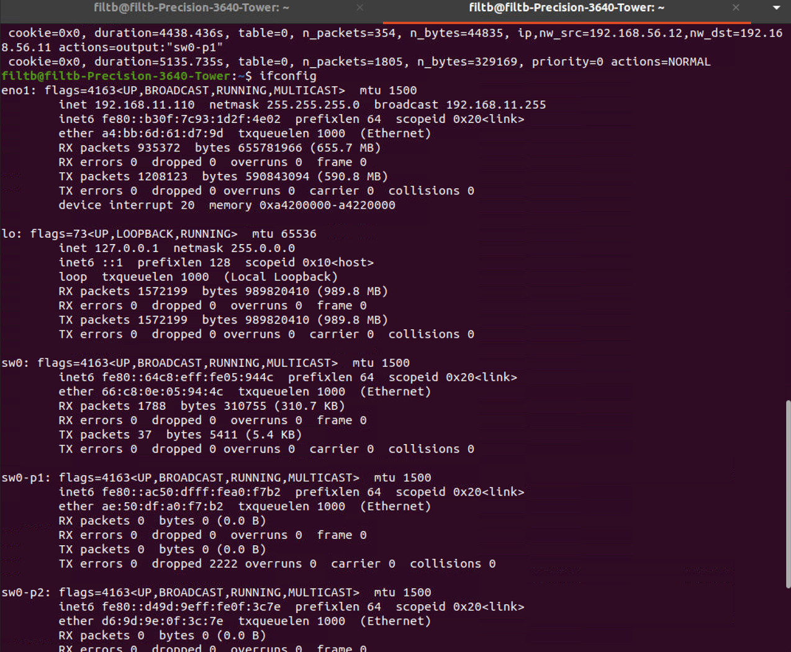
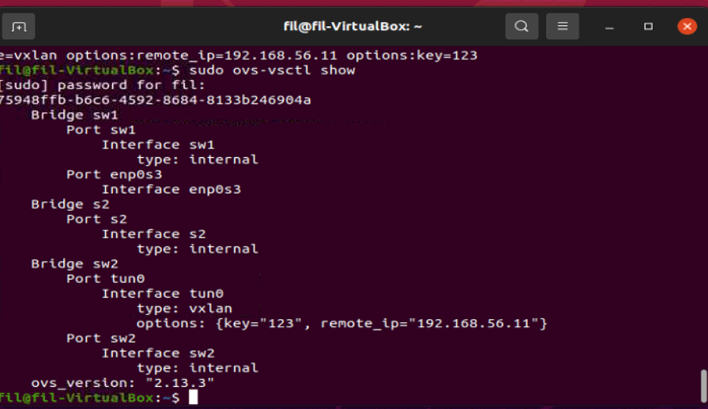
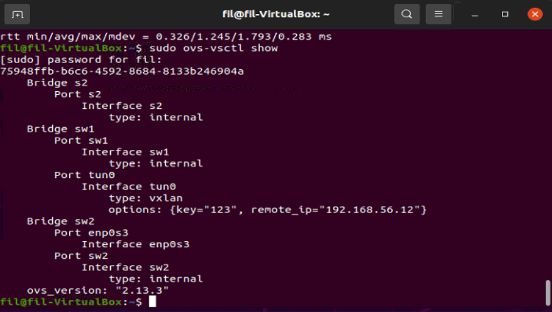
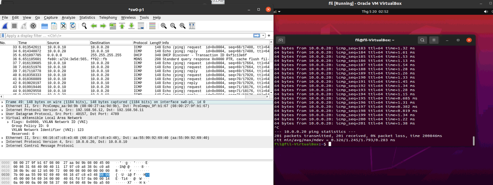

# Contents

- [Contents](#contents)
  - [OpenvSwitch](#openvswitch)
  - [Practice 1](#practice-1)
    - [Topology](#topology)
    - [Chuẩn bị](#chuẩn-bị)
    - [Cấu hình](#cấu-hình)
    - [Cài Wireshark và test ping](#cài-wireshark-và-test-ping)
  - [Điểm mạnh và điểm yếu của Vxlan trong Datacenter](#điểm-mạnh-và-điểm-yếu-của-vxlan-trong-datacenter)

## OpenvSwitch

OpenvSwitch (OVS) là một dự án về chuyển mạch ảo đa lớp (multilayer). Mục đích chính của OpenvSwitch là cung cấp lớp chuyển mạch cho môi trường ảo hóa phần cứng, trong khi hỗ trợ nhiều giao thức và tiêu chuẩn được sử dụng trong hệ thống chuyển mạch thông thường. OpenvSwitch hỗ trợ nhiều công nghệ ảo hóa dựa trên nền tảng Linux như Xen/XenServer, KVM, và VirtualBox.


OpenvSwitch hỗ trợ các tính năng sau: - VLAN tagging & 802.1q trunking - Standard Spanning Tree Protocol (802.1D) - LACP - Port Mirroring (SPAN/RSPAN) - Tunneling Protocols - QoS

**Vxlan - Virtual Extensible LAN**

VXLAN là viết tắt của Virtual Extensible LAN, được định nghĩa trong RFC 7348 là một công nghệ overlay được thiết kế để cung cấp các dịch vụ kết nối Layer 2 và Layer 3 thông qua mạng IP.

VXLAN đạt được điều này bằng cách tạo các Frames Layer 2 bên trong IP Packets. VXLAN chỉ yêu cầu khả năng giao tiếp IP giữa các thiết bị biên trong mô hình VXLAN, được cung cấp bởi các giao thức định tuyến.



---

## Practice 1

- Hiểu cơ bản vê hoạt động của VXLAN

- Phân tích bản tin VXLAN

- Cấu hình cơ bản với Openvswitch

### Topology 



---

### Chuẩn bị

- Ta cài 2 máy ảo Linux như các bài tập trước VM1 và VM2 kết nối qua Bridged Adapter ( *192.168.56.11* và *192.168.56.12*)
- Cài OpenvSwitch trên máy vật lý và 2 máy ảo VM1, VM2
- Sử dụng OpenvSwitch tạo 1 switch ảo SW0 tại host. Qua đó truyền thông giữa 2 máy ảo với nhau.
- Trên các máy ảo tạo thêm các switch: VM1 (SW1,SW2) VM2 (SW2, SW1)

---

### Cấu hình

1. Cài OpenvSwitch trên Host, VM1, VM2

```bash
sudo apt install openvswitch-switch
```

Sau khi cài đặt xong, chạy ```ovs-vsctl show``` để kiểm tra việc cài đặt đã thành công:


2. Tạo switch và 2 interface ảo trên Host

```bash
$ sudo ovs-vsctl add-br sw0
$ sudo tuntap add mode tap sw0-p1  \\tạo interface ảo
$ sudo tuntap add mode tap sw0-p2
$ sudo ovs-vsctl add-port sw0 sw0-p1
sudo ovs-vsctl add-port sw0 sw0-p2

$ sudo interface sw0 up
$ sudo interface sw0-p1 up
$ sudo interface sw0-p2 up
```

Tạo flow-tables truyền thông các interface ảo cho SW0

```bash
sudo ovs-ofctl add-flow sw0 ip,nw_src=192.168.56.11,nw_dst=192.168.56.12,actions=output:p2
sudo ovs-ofctl add-flow sw0 ip,nw_src=10.0.0.20,nw_dst=10.0.0.10,actions=output:p1
```

Kiểm tra kết quả bằng lệnh

```bash

$ sudo ifconfig
$ sudo ovs-vsctl show
sudo ovs-ofctl dump-flows s1
```



Switch config


Dump-flow


3. Cấu hình các Virtual Machines

**VM1:**

- Tạo switch 

```bash
sudo ovs-vsctl add-br sw1
sudo ovs-vsctl add-br sw2

sudo interface sw1 10.0.0.10/24
sudo interface sw2 192.168.56.11/24

sudo ip link set sw1 up
sudo ip link set sw2 up

sudo ovs-vsctl add-port sw2 enp0s3 \\kết nối sw2 với interface của máy ảo
```

**VM2:**

```bash
sudo ovs-vsctl add-br sw1
sudo ovs-vsctl add-br sw2

sudo interface sw2 10.0.0.20/24
sudo interface sw1 192.168.56.12/24

sudo ip link set sw1 up
sudo ip link set sw2 up

sudo ovs-vsctl add-port sw1 enp0s3 \\kết nối sw2 với interface của máy ảo
```

**Tạo Tunnels Vxlan**

```bash
VM1
----
ovs-vsctl add-port sw1 tun0 -- set interface tun0 type=vxlan options:remote_ip=192.168.56.12 options:key=123

VM2
----
ovs-vsctl add-port sw2 tun0 -- set interface tun0 type=vxlan options:remote_ip=192.168.56.12 options:key=123
```

Kết quả:

- Trên VM1



- Trên VM2



---

### Cài Wireshark và test ping

- Cài Wireshark sử dụng cổng sw0-p1 hoặc sw0-p2 để capture gói tin
- Phân tích một gói tin ICMP bắt được trên interface eth0 có kết quả như sau.



---

## Điểm mạnh và điểm yếu của Vxlan trong Datacenter

- ### Điểm mạnh
    - Tăng số lượng segments lớp 2: Các thiết kế dựa trên Vlan bị giới hạn tối đa 4.096 phân đoạn Lớp 2 do sử dụng Vlan ID 12 bit. VXLAN giới thiệu một VNID 24 bit về mặt lý thuyết hỗ trợ tới 16 triệu segments.
    - Hỗ trợ nhiều khách hàng trên cùng 1 hệ thống: VXLAN Fabric hỗ trợ nhiều khách hàng trên cả Lớp 2 (mỗi VNID định danh cho 1 khách hàng khác nhau) và Lớp 3 (sử dụng VRF khác nhau cho mỗi khách hàng khác nhau.
    - Tính di động: VM có thể di chuyển giữa các Server hiện tại trong các miền Lớp 2 riêng biệt bằng cách tạo đường hầm truy cập thông qua mạng IP. Vì vậy, bạn có thể linh hoạt phân bổ tài nguyên trong hoặc giữa các trung tâm dữ liệu mà không bị ràng buộc bởi các ranh giới Lớp 3. Cung cấp tính linh hoạt và di động khi thiết kế các mạng Layer 2.
    - Multi-path Layer 2: các mạng lớp 2 chỉ hỗ trợ 1 tuyến đường hoạt động vì STP sẽ Block các đường dự phòng để tránh loop. VXLAN hoạt động dựa trên các mạng Lớp 3 cung cấp nhiều tuyến đường tới đích mà không phụ thuộc vào STP.
    - Tận dụng tốt hơn các kết nối mạng khả dụng trong cơ sở hạ tầng bên dưới: Các gói tin VXLAN được truyền qua các lớp mạng dựa vào thông tin trong Header cùng giao thức định tuyến của Lớp 3 để sử dụng tất cả các kết nối sẵn có.

- ### Điểm yếu

    - Để triển khai được công nghệ Vxlan trên quy mô lớn, cần phải rủ bỏ những khái niệm cũ về thiết bị vật lý như Switch, Firewall, Loadbanacer…
    - Gói tin cần đóng gói thêm nên chắc là sẽ tốn thêm lưu lượng cho Header :D 