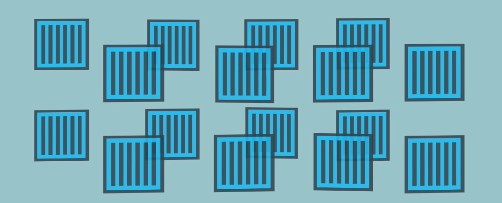
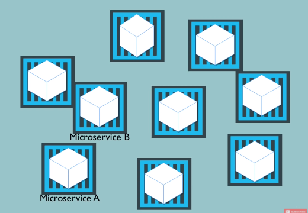
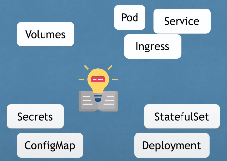
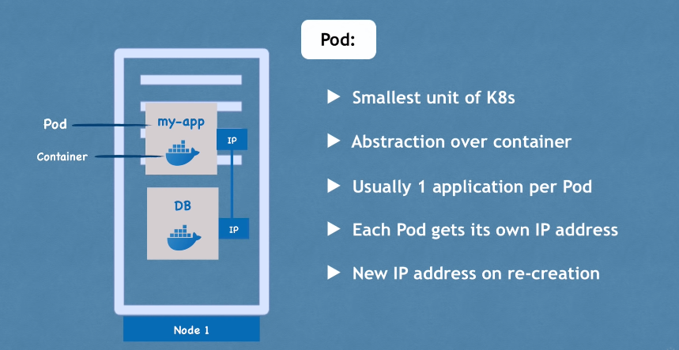
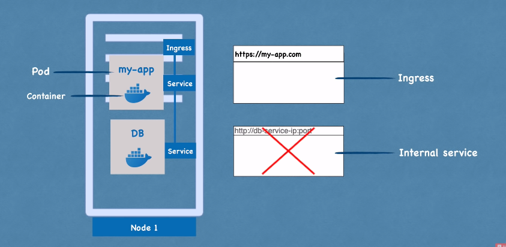
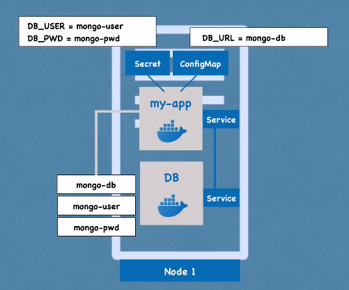
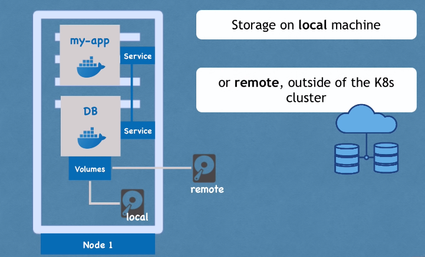
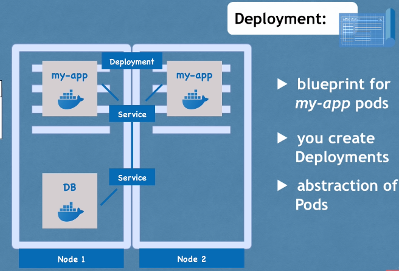
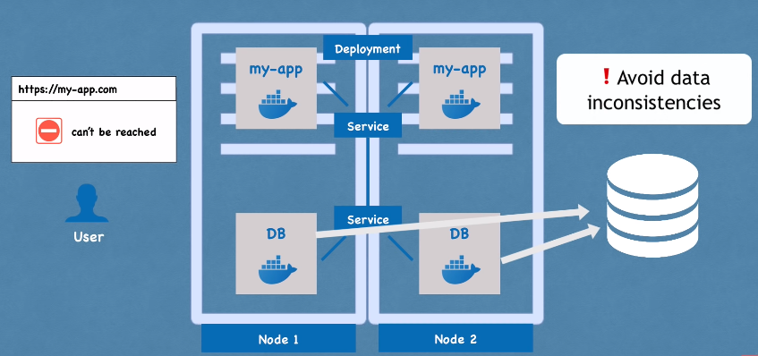
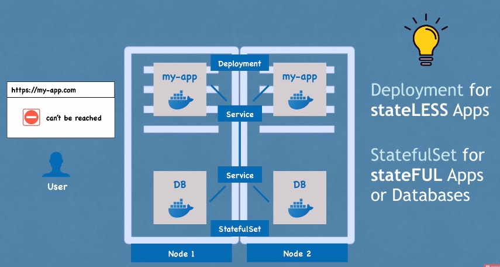

# PaaS and Kubernetes

## Content

- [PaaS and Kubernetes](#paas-and-kubernetes)
  - [Content](#content)
  - [A. Kiến thức cơ bản liên quan về PaaS và Kubernetes](#a-kiến-thức-cơ-bản-liên-quan-về-paas-và-kubernetes)
    - [**1. Platform as a Service**](#1-platform-as-a-service)
    - [**2. Kubernetes**](#2-kubernetes)
    - [**3. Kubernetes Components**](#3-kubernetes-components)
  - [B. Install Kubernetes on PC by using mini-kube](#b-install-kubernetes-on-pc-by-using-mini-kube)
    - [**1. Cài đặt và cấu hình kubectl**](#1-cài-đặt-và-cấu-hình-kubectl)
  - [C. Write manifest file to deploy the system of Wordpess on the Kubernetes](#c-write-manifest-file-to-deploy-the-system-of-wordpess-on-the-kubernetes)
  - [DEBUG](#debug)
  - [Tài liệu tham khảo](#tài-liệu-tham-khảo)


---

## A. Kiến thức cơ bản liên quan về PaaS và Kubernetes

### **1. Platform as a Service**
Nền tảng là một dịch vụ (PaaS) là mô hình điện toán đám mây trong đó nhà cung cấp bên thứ ba cung cấp các công cụ phần cứng và phần mềm – thường là những công cụ cần thiết để phát triển ứng dụng – cho người dùng qua internet. Một nhà cung cấp PaaS lưu trữ phần cứng và phần mềm trên cơ sở hạ tầng của riêng mình . Do đó, PaaS giải phóng các nhà phát triển khỏi việc phải cài đặt phần cứng và phần mềm nội bộ để phát triển hoặc chạy một ứng dụng mới.

### **2. Kubernetes**

**2.1 Official Definition**

*"Kubernetes (K8s) is an open-source system for automating deployment, scaling, and management of containerized applications."*

  - Open source **container orchestration tool**
  - Developed by **Google**
  - Helps you **manage containerized applications** in different **deployment environments**
    - physical
    - virtual
    - cloud
    
    


```
 Xét dưới góc độ phần cứng thì Kubernetes là một tập hợp các node. Node là một máy vật lý hoặc máy ảo

Các node trong Kubernetes được chia thành 2 loại:

- worker node: chạy các Docker container
- master node: quản lý, điều phối các container trên worker node

Các node trong Kubernetes gộp lại thành 1 cluster. Kubernetes nhìn cluster này như một máy tính duy nhất, mỗi node được thêm vào hay gỡ ra khỏi cluster thì cũng giống như thêm hoặc bớt CPU/RAM cho cụm máy
<https://techmaster.vn/posts/35919/khoa-hoc-kubernetes-cho-nguoi-moi-bat-dau-phan-1-cung-tim-hieu-ve-kien-truc-cua-kubernetes>

```

**2.2 Problem-Solution case study**

The need for a container orchestration tool

- Trend from **Monolith** to **Microservices**
- Increased usage of **containers**
- Demand for a **proper way** of **managing** those hundreds of containers 
  
    
  
**2.3 What features do orchestration tools offer?**

- **High Availability** or no downtime
- **Scalability** or high performance
- **Disaster recovery** - backup and restore

### **3. Kubernetes Components**

Main Kubernetes Components sumnaried

> - Node and Pod: abstraction of containers
> - Service: communication
> - Ingress: route trafic into cluster
> - ConfigMap: external configuration
> - Secrets; secure external configuration
> - Volumes
> - Statefulset
> - Deployment
> 
>   

---
3.1 Node and Pod



3.2 Service and Ingress

- Services
  - permanent IP address
  - load balancer
  - lifecycle of Pod and Service NOT connected (mỗi lần pod gặp vấn đề cần restart hoặc replace thì IP address của pod sẽ không thay đổi)
  - External service/ Internal service
- Ingress
  - translate domain name to IP address ( sau do chuyen toi service )
  


3.3 ConfigMap and Secrets

- ConfigMap: 
  - external configuration of your application
  - Giúp chúng ta không phải tạo lại image mỗi lần thay đổi thông số
- Secrets
  - tương tự configMap nhưng secure hơn
  - Used to store secret data
  - base64 encoded
  
    

3.4 Volumes

Mỗi lần có vấn đề, hoặc khởi động lại, data storage trong container sẽ mất đi. Do đó ta cần phải có chỗ lưu trữ database cố định.
K8s Cluster thường kết nối với Storage ở ngoài



3.5 Deployment

Bạn sẽ không làm việc với Pod, không tạo thêm pod mà Deployments sẽ định nghĩa việc đó. Từ đó scale số replica của pod.



3.6 StatefulSet

Đối với database thì không thể clone, hoặc khi clone chúng ra vẫn phải truy cập vào cùng 1 volumes cũ, từ đó sinh ra StatefulSet




Deploying StatefulSet not easy -> DB are often hosted outside of K8s cluster to not affect cluster.

---

## B. Install Kubernetes on PC by using mini-kube

**Chuẩn bị cấu hình cài đặt**


### **1. Cài đặt và cấu hình kubectl**

Công cụ command-line trong Kubernetes, kubectl, cho phép bạn thực thi các câu lệnh trong Kubernetes clusters. Bạn có thể sử dụng kubectl để triển khai các ứng dụng, theo dõi và quản lý tài nguyên của cluster, và xem log. Để biết các thao tác của kubectl, truy cập tới  [Tổng quan về kubectl.](https://kubernetes.io/docs/reference/kubectl/overview/)


---

## C. Write manifest file to deploy the system of Wordpess on the Kubernetes

---

## DEBUG

---

## Tài liệu tham khảo

1. https://kubernetes.io/vi/docs/tasks/tools/_print/#pg-bbdc530b292ab4074d1dfe69feafb3e7 